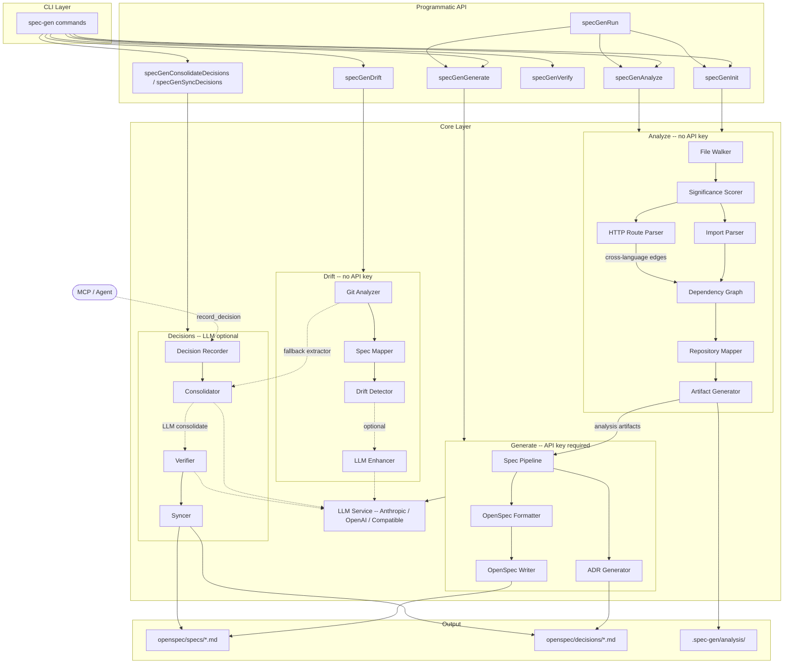

# spec-gen

**Persistent architectural memory for AI coding agents.**

spec-gen turns any codebase into a navigable knowledge graph. It extracts living specifications, detects spec/code drift, gates architectural decisions, and exposes everything through 45 graph-aware MCP tools — so agents start every session already knowing the codebase instead of re-discovering it.

---

## Why It Exists

AI agents are powerful but amnesiac. On every new task:

- They re-read the same source files to understand structure
- They forget architectural decisions made two sessions ago
- They have no link between specs and code — drift is invisible
- File-by-file navigation burns **15,000–50,000 tokens** per orientation pass, before a single line of useful code is written

spec-gen closes this loop. Run it once. Wire two files into your agent's context. Every subsequent session starts informed.

---

## How It Works

Three layers, each usable independently:

| Layer | What it does | API key? |
|-------|-------------|----------|
| **1. Static Analysis** | Call graph, clusters, McCabe CC, external deps → `CODEBASE.md` digest | No |
| **2. Spec Layer** | LLM-generated living specs, ADRs, drift detection, decision gates | For generation |
| **3. Agent Runtime** | 45 MCP tools — `orient()`, semantic search, graph expansion | No |

You can use layer 1 alone to give agents structural context. Add layer 2 for spec coverage. Layer 3 is always-on once `spec-gen mcp` is running.

---

## spec-gen vs. Alternatives

| | Cursor / Claude Code | Sourcegraph | spec-gen |
|---|---|---|---|
| Graph-aware MCP context | ❌ file-based reads | Partial | ✓ call graph + clusters |
| Spec drift detection | ❌ | ❌ | ✓ milliseconds, no API |
| Architectural decision gates | ❌ | ❌ | ✓ pre-commit hook |
| Works fully offline (analysis) | ❌ | ❌ | ✓ |
| Token-efficient orient() | ❌ | ❌ | ✓ ~1–3k vs 15–50k tokens |
| Living spec generation | ❌ | ❌ | ✓ |

Cursor and Claude Code read files. spec-gen reads the graph.

---

## 5-Minute Quickstart

> **Minimum to see value — no API key needed:**

```bash
npm install -g spec-gen-cli
cd /path/to/your-project

spec-gen analyze          # build call graph, clusters, CODEBASE.md
spec-gen mcp              # start MCP server
```

Then ask your agent: **`orient("add a new payment method")`**

That single call returns the relevant functions, their call neighbours, matching spec sections, and insertion-point candidates — in one round-trip instead of a dozen file reads, costing ~1,000 tokens instead of ~30,000.

**Full pipeline** (specs + decisions — optional and additive):

```bash
spec-gen generate         # generate living specs (requires API key)
spec-gen drift            # detect spec/code drift
spec-gen decisions        # manage architectural decisions
```

<details>
<summary>Install from source</summary>

```bash
git clone https://github.com/clay-good/spec-gen
cd spec-gen
npm install && npm run build && npm link
```

</details>

<details>
<summary>Nix / NixOS</summary>

```bash
nix run github:clay-good/spec-gen -- analyze
nix shell github:clay-good/spec-gen
```

System flake:
```nix
environment.systemPackages = [ spec-gen.packages.x86_64-linux.default ];
```

</details>

---

## See It In Action

<details>
<summary>Example: orient("add a payment method")</summary>

```json
{
  "functions": [
    {
      "name": "processPayment",
      "file": "src/payments/processor.ts",
      "risk": "medium",
      "fanIn": 4,
      "callers": ["handleCheckout", "retryFailedCharge"],
      "callType": "direct"
    },
    {
      "name": "validateCard",
      "file": "src/payments/validator.ts",
      "risk": "low",
      "fanIn": 1,
      "testedBy": [{ "name": "validateCard.test.ts", "confidence": "called" }]
    }
  ],
  "specDomains": ["payments — §CardValidation, §PaymentFlow"],
  "insertionPoints": [
    "src/payments/processor.ts:87 — after existing charge logic"
  ],
  "callPath": "POST /charge → handleCheckout → processPayment → validateCard → stripeClient.charge"
}
```

One call. No file reads. The agent knows exactly where to look and what risks to consider.

</details>

---

## Core Features

**Analyze** (no API key)

Scans your codebase with pure static analysis. Builds a full call graph, runs label-propagation community detection to cluster tightly coupled functions, computes McCabe cyclomatic complexity for every function, and extracts DB schemas, HTTP routes, UI components, middleware chains, and environment variables. Outputs `.spec-gen/analysis/CODEBASE.md` — a ~600-token structural digest that replaces 30,000+ tokens of file exploration.

**Generate** (API key required)

Sends the analysis to an LLM in 6 structured stages: project survey → entity extraction → service analysis → API extraction → architecture synthesis → ADR enrichment. Produces `openspec/specs/` living specifications in RFC 2119 format with Given/When/Then scenarios.

**Drift** (no API key)

Compares git changes against spec mappings in milliseconds. Detects: Gap (code changed, spec not updated), Uncovered (new file, no spec), Stale (spec references deleted files), ADR gap (code changed in an ADR-referenced domain). Installs as a pre-commit hook.

**MCP** (no API key)

45 graph-aware tools exposed over stdio. `orient()` is the main entry point — one call replaces 10+ file reads. `detect_changes` risk-scores changed functions using call graph centrality × change type multiplier. See [docs/mcp-tools.md](docs/mcp-tools.md).

**Decisions** (API key for consolidation)

Agents call `record_decision` before writing code. Consolidation runs immediately in the background. At commit time, a pre-commit hook gates the commit until all verified decisions are reviewed and written back as requirements in `spec.md` files.

---

## Architecture



---

## Documentation

| Topic | Doc |
|-------|-----|
| MCP tools reference (45 tools + parameters) | [docs/mcp-tools.md](docs/mcp-tools.md) |
| Agent setup (Claude Code, Cline, OpenCode, Vibe…) | [docs/agent-setup.md](docs/agent-setup.md) |
| LLM providers + embedding config | [docs/providers.md](docs/providers.md) |
| Drift detection in depth | [docs/drift-detection.md](docs/drift-detection.md) |
| Spec-driven tests + spec digest | [docs/spec-tests.md](docs/spec-tests.md) |
| CI/CD integration | [docs/ci-cd.md](docs/ci-cd.md) |
| CLI command reference | [docs/cli-reference.md](docs/cli-reference.md) |
| Interactive graph viewer | [docs/viewer.md](docs/viewer.md) |
| Analysis output files | [docs/output.md](docs/output.md) |
| Configuration reference | [docs/configuration.md](docs/configuration.md) |
| Programmatic API | [docs/api.md](docs/api.md) |
| Pipeline architecture | [docs/pipeline.md](docs/pipeline.md) |
| Internal design | [docs/ARCHITECTURE.md](docs/ARCHITECTURE.md) |
| Algorithms | [docs/ALGORITHMS.md](docs/ALGORITHMS.md) |
| Agentic workflows (BMAD, Vibe, GSD, spec-kit) | [docs/agentic-workflows.md](docs/agentic-workflows.md) |
| Troubleshooting | [docs/TROUBLESHOOTING.md](docs/TROUBLESHOOTING.md) |
| Philosophy | [docs/PHILOSOPHY.md](docs/PHILOSOPHY.md) |

---

## Known Limitations

- **Full re-analyze required**: no incremental graph update. Run `spec-gen analyze` after significant refactors.
- **Static analysis only**: dynamic dispatch, runtime metaprogramming, and `eval`-based patterns are not captured in the call graph.
- **LLM spec quality varies**: generated specs reflect the model's understanding. Review sections covering complex business logic before treating them as authoritative.
- **Embedding is optional**: without an embedding endpoint, `orient` and `search_code` fall back to BM25 keyword search (still useful, less accurate for semantic queries).
- **Large monorepos**: `spec-gen analyze` on 500k+ LOC projects may take several minutes. The graph is cached after the first run.

---

## Requirements

- Node.js 20+
- API key for `generate`, `verify`, and `drift --use-llm`:
  ```bash
  export ANTHROPIC_API_KEY=sk-ant-...    # default provider
  export OPENAI_API_KEY=sk-...           # OpenAI
  export GEMINI_API_KEY=...              # Google Gemini
  ```
  Or use a CLI-based provider (`claude-code`, `gemini-cli`, `mistral-vibe`, `cursor-agent`) — no API key, just the CLI on your PATH.
- `analyze`, `drift`, `mcp`, and `init` require no API key

**Languages supported**: TypeScript · JavaScript · Python · Go · Rust · Ruby · Java · C++ · Swift

---

## Development

```bash
npm install
npm run build
npm test          # 2300+ unit tests
npm run typecheck
```

---

## Links

- [OpenSpec](https://github.com/Fission-AI/OpenSpec) — spec-driven development framework
- [AGENTS.md](AGENTS.md) — system prompt for direct LLM prompting
- [Examples](examples/) — BMAD, Vibe, GSD, drift-demo, spec-kit integrations
