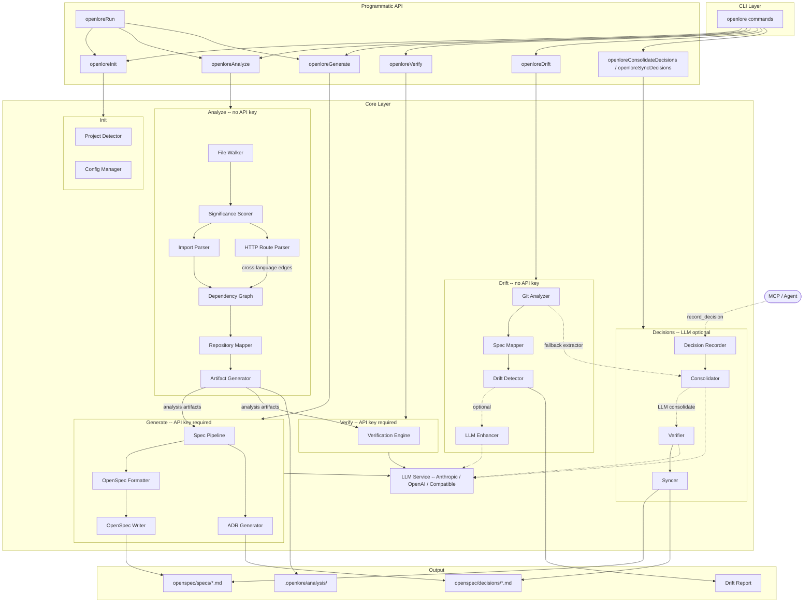

## Architecture

```mermaid
graph TD
    subgraph CLI["CLI Layer"]
        CMD[openlore commands]
    end

    subgraph API["Programmatic API"]
        API_INIT[openloreInit]
        API_ANALYZE[openloreAnalyze]
        API_GENERATE[openloreGenerate]
        API_VERIFY[openloreVerify]
        API_DRIFT[openloreDrift]
        API_RUN[openloreRun]
        API_DECISIONS[openloreConsolidateDecisions / openloreSyncDecisions]
    end

    subgraph Core["Core Layer"]
        direction TB

        subgraph Init["Init"]
            PD[Project Detector]
            CM[Config Manager]
        end

        subgraph Analyze["Analyze -- no API key"]
            FW[File Walker] --> SS[Significance Scorer]
            SS --> IP[Import Parser]
            IP --> DG[Dependency Graph]
            SS --> HR[HTTP Route Parser]
            HR -->|cross-language edges| DG
            DG --> RM[Repository Mapper]
            RM --> AG[Artifact Generator]
        end

        subgraph Generate["Generate -- API key required"]
            SP[Spec Pipeline] --> FF[OpenSpec Formatter]
            FF --> OW[OpenSpec Writer]
            SP --> ADR[ADR Generator]
        end

        subgraph Verify["Verify -- API key required"]
            VE[Verification Engine]
        end

        subgraph Drift["Drift -- no API key"]
            GA[Git Analyzer] --> SM[Spec Mapper]
            SM --> DD[Drift Detector]
            DD -.->|optional| LE[LLM Enhancer]
        end

        subgraph Decisions["Decisions -- LLM optional"]
            DR[Decision Recorder]
            DR --> DC[Consolidator]
            DC -.->|LLM consolidate| DV[Verifier]
            DV --> DS[Syncer]
            GA -.->|fallback extractor| DC
        end

        LLM[LLM Service -- Anthropic / OpenAI / Compatible]
    end

    CMD --> API_INIT & API_ANALYZE & API_GENERATE & API_VERIFY & API_DRIFT & API_DECISIONS
    API_RUN --> API_INIT & API_ANALYZE & API_GENERATE

    API_INIT --> Init
    API_ANALYZE --> Analyze
    API_GENERATE --> Generate
    API_VERIFY --> Verify
    API_DRIFT --> Drift
    API_DECISIONS --> Decisions

    Generate --> LLM
    Verify --> LLM
    LE -.-> LLM
    DC -.-> LLM
    DV -.-> LLM

    MCP([MCP / Agent]) -.->|record_decision| DR

    AG -->|analysis artifacts| SP
    AG -->|analysis artifacts| VE

    subgraph Output["Output"]
        SPECS[openspec/specs/*.md]
        ADRS[openspec/decisions/*.md]
        ANALYSIS[.openlore/analysis/]
        REPORT[Drift Report]
    end

    OW --> SPECS
    ADR --> ADRS
    AG --> ANALYSIS
    DD --> REPORT
    DS --> SPECS
    DS --> ADRS
```

