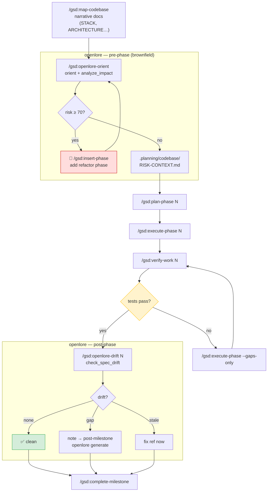

# openlore commands for get-shit-done (GSD)

Two Claude Code slash commands that add structural risk analysis and spec drift
verification to the [get-shit-done](https://github.com/gsd-build/get-shit-done) workflow.

Part of the [openlore agentic workflow pattern](../../docs/agentic-workflows/README.md).

## Commands

| Command | When | What it does |
|---|---|---|
| `/gsd:openlore-orient` | Before `/gsd:execute-phase` | orient + risk gate → writes `.planning/codebase/RISK-CONTEXT.md` |
| `/gsd:openlore-drift` | After `/gsd:verify-work` passes | drift check → appends spec status to `RISK-CONTEXT.md` |

## Installation

Copy the `commands/` directory into your project's `.claude/` folder:

```bash
cp -r examples/gsd/commands/.claude/commands/gsd/ .claude/commands/gsd/
```

Or copy into your global Claude Code commands:

```bash
cp -r examples/gsd/commands/gsd/ ~/.claude/commands/gsd/
```

## Prerequisites

1. openlore MCP server configured in `.claude/settings.json`
2. `openlore analyze $PROJECT_ROOT` run at least once

## Workflow



```
/gsd:new-project or /gsd:map-codebase   ← existing GSD commands

# openlore pre-flight (brownfield)
/gsd:openlore-orient [phase]            ← risk gate, writes RISK-CONTEXT.md

/gsd:plan-phase [N]                     ← existing GSD command
/gsd:execute-phase [N]                  ← existing GSD command
/gsd:verify-work [N]                    ← existing GSD command

# openlore post-flight (once verify-work passes)
/gsd:openlore-drift [N]                 ← drift check, appends to RISK-CONTEXT.md

/gsd:complete-milestone                 ← existing GSD command
```

## Risk gate

| Score | Level | Action |
|---|---|---|
| < 40 | 🟢 low | Proceed to execute-phase |
| 40–69 | 🟡 medium | Proceed — protect callers listed in RISK-CONTEXT.md |
| ≥ 70 | 🔴 high / critical | Stop — use `/gsd:insert-phase` to add a refactor phase first |

## OpenSpec spec baseline

`/gsd:openlore-orient` uses `search_specs` to surface relevant requirements, and
`/gsd:openlore-drift` uses `check_spec_drift` to verify alignment. Both require
OpenSpec specs to exist — without them, results are empty or everything shows as uncovered.

| State | What to do |
|---|---|
| No specs yet | Run `openlore generate $PROJECT_ROOT` before the first phase — or let `/gsd:openlore-drift` offer to do it |
| Specs exist | Both commands work as expected |
| New code not yet spec'd | `drift` flags it as `uncovered` — run `openlore generate` post-milestone |

Both commands detect missing specs automatically and prompt you to generate them.

## Relation to `/gsd:map-codebase`

`/gsd:map-codebase` uses parallel mapper agents to produce narrative documents
(STACK.md, ARCHITECTURE.md, etc.) — great for onboarding and big-picture understanding.

`/gsd:openlore-orient` is complementary: it produces **quantitative risk data** (fan-in,
fan-out, risk scores, call paths) from a pre-built static index. Both can coexist —
run `map-codebase` once for narrative context, `openlore-orient` before each phase for
risk-aware execution.
