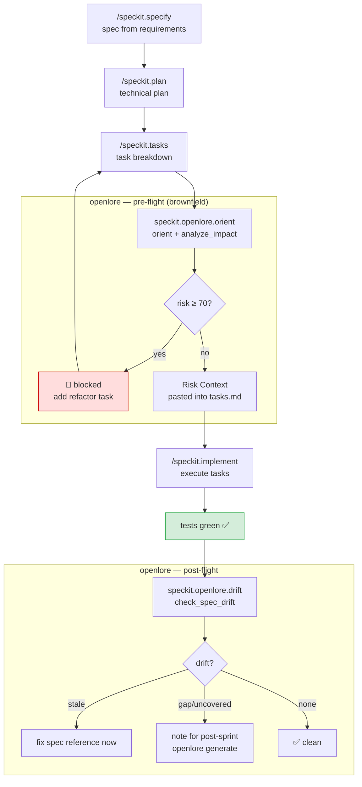

# openlore extension for spec-kit

Adds structural risk analysis and spec drift verification to the
[spec-kit](https://github.com/github/spec-kit) Spec-Driven Development workflow.

Part of the [openlore agentic workflow pattern](../../docs/agentic-workflows/README.md).

## What it does

| Hook | Command | When |
|---|---|---|
| `before_implement` | `speckit.openlore.orient` | Before `/speckit.implement` — orient + risk gate |
| `after_implement` | `speckit.openlore.drift` | After implementation + green tests — drift check |

## When to use it

**Brownfield** (existing codebase): always useful. `orient` surfaces high-risk functions
before you touch them; `drift` confirms the implementation stays aligned with specs.

**Greenfield** (new project, no existing code): skip `orient` (nothing to analyse yet).
`drift` is useful once `openlore generate` has been run at least once.

## Installation

```bash
# In your project directory
specify extension add openlore
```

Or manually copy this directory into `.specify/extensions/openlore/`.

## Prerequisites

1. openlore MCP server running and configured in your AI agent
2. `openlore analyze $PROJECT_ROOT` run at least once

## Workflow



```
/speckit.specify       → spec from requirements
/speckit.plan          → technical plan from spec
/speckit.tasks         → task breakdown from plan

# openlore pre-flight (brownfield only)
/speckit.openlore.orient   → orient + risk gate → paste Risk Context into tasks.md

/speckit.implement     → execute tasks

# openlore post-flight (once tests are green)
/speckit.openlore.drift    → drift check → note any spec updates needed
```

## OpenSpec spec baseline

`speckit.openlore.orient` uses `search_specs` to surface relevant requirements, and
`speckit.openlore.drift` uses `check_spec_drift` to verify alignment. Both require
OpenSpec specs to exist — without them, results are empty or everything shows as uncovered.

| State | What to do |
|---|---|
| No specs yet | Run `openlore generate $PROJECT_ROOT` once before the first sprint |
| Specs exist | Both commands work as expected |
| New code not yet spec'd | `drift` will flag it as `uncovered` — run `openlore generate` to update |

Both commands detect missing specs automatically and offer to run `openlore generate`.

## Risk gate

| Score | Level | Action |
|---|---|---|
| < 40 | 🟢 low | Proceed |
| 40–69 | 🟡 medium | Proceed — protect listed callers |
| ≥ 70 | 🔴 high / critical | Stop — refactor first |
