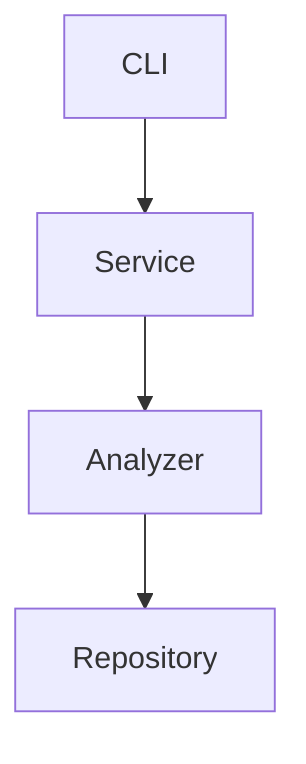

# Architecture Specification

> Generated by spec-gen v1.0.0 on 2026-03-09 23:34

## Purpose

This document describes the architectural patterns and structure of the system.

## Architecture Style

Layered architecture: CLI interface → service layer → analyzer layer → repository layer. This
pattern is justified by the need to separate concerns, improve maintainability, and facilitate
testing. The layered approach allows for clear separation of business logic, data access, and
presentation layers.

## Requirements

### Requirement: LayeredArchitecture

The system SHALL maintain separation between:
- CLI (Command-line interface and user interaction)
- Service (Business logic and orchestration)
- Analyzer (Code analysis and data extraction)
- Repository (Data persistence and retrieval)

#### Scenario: LayerSeparation
- **GIVEN** a request from the presentation layer
- **WHEN** business logic is needed
- **THEN** the presentation layer delegates to the business layer
- **AND** direct database access from presentation is prohibited

### Requirement: SecurityModel

The system SHALL implement security via: No explicit authentication or authorization mechanisms are evident in the provided analysis. The tool relies on local file operations and LLM interactions, which may require user configuration for secure access to external services.

#### Scenario: AuthenticatedAccess
- **GIVEN** an unauthenticated request
- **WHEN** accessing protected resources
- **THEN** access is denied

## System Diagram

## Layer Structure

### CLI

**Purpose**: Command-line interface and user interaction
**Location**: `src/cli/commands/mcp.ts, src/cli/commands/view.ts, src/cli/commands/analyze.ts, src/cli/commands/drift.ts`

### Service

**Purpose**: Business logic and orchestration
**Location**: `src/core/services/chat-tools.ts, src/core/services/config-manager.ts, src/core/services/llm-service.ts, src/core/services/project-detector.ts, src/core/services/mcp-handlers/utils.ts`

### Analyzer

**Purpose**: Code analysis and data extraction
**Location**: `src/core/analyzer/repository-mapper.ts, src/core/analyzer/call-graph.ts, src/core/analyzer/dependency-graph.ts, src/core/analyzer/spec-vector-index.ts, src/core/analyzer/vector-index.ts`

### Repository

**Purpose**: Data persistence and retrieval
**Location**: `src/core/analyzer/embedding-service.ts, src/core/analyzer/signature-extractor.ts, src/core/analyzer/import-export-parser.ts`

## Data Flow

CLI command → service layer → analyzer layer → repository layer; results are persisted and can be
retrieved for further analysis or generation of specifications.

## External Integrations

| System | Purpose |
|--------|---------|
| OpenAI-compatible APIs | External integration |
| Local LLM providers (Claude Code, Mistral Vibe) | External integration |
| Git for version control and diff operations | External integration |
| LanceDB for vector indexing and semantic search | External integration |
